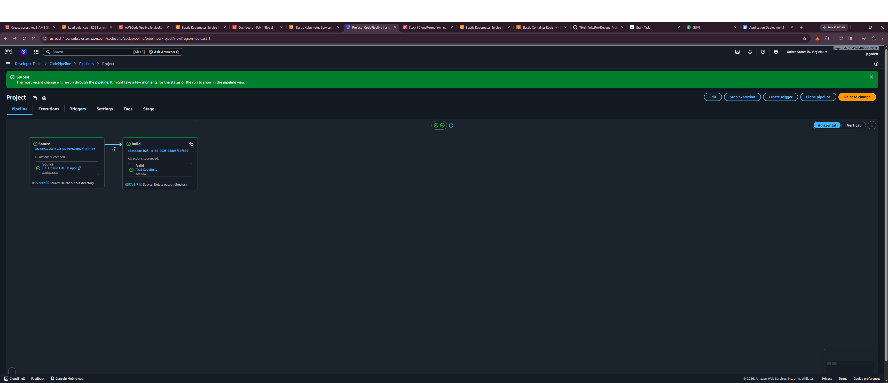
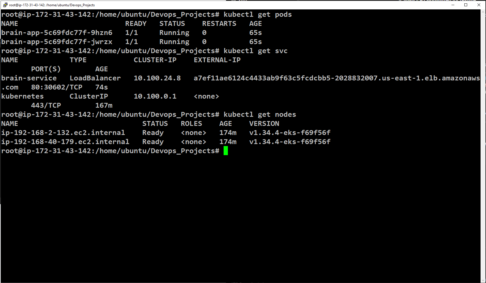
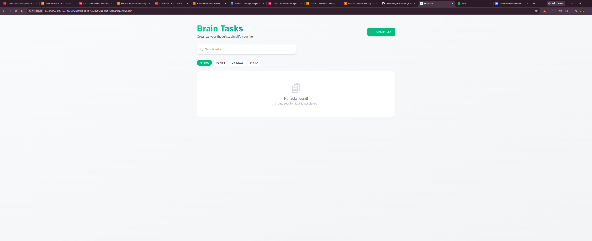
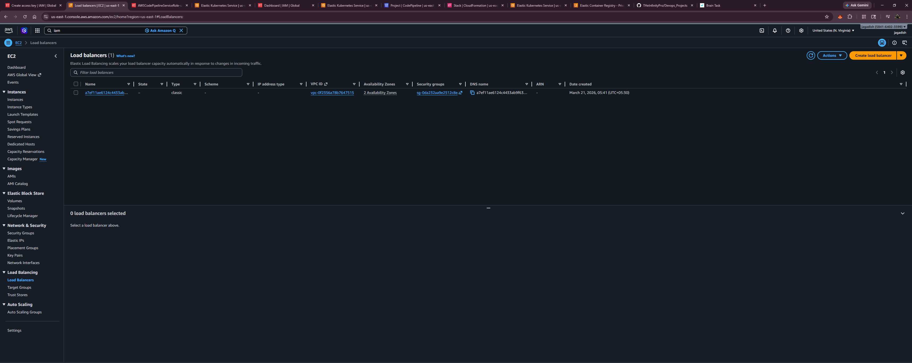

# 🚀 AWS DevOps CI/CD Pipeline with EKS

## 📌 Project Description

This project demonstrates an end-to-end **CI/CD pipeline** using AWS services to build, push, and deploy a containerized application to **Amazon EKS (Kubernetes)**.

---

## 🧰 Tech Stack

* AWS CodePipeline
* AWS CodeBuild
* Amazon ECR
* Amazon EKS
* Docker
* Kubernetes (kubectl)
* IAM

---

## 🔄 CI/CD Pipeline Flow

1. **Source Stage**

   * Code fetched from GitHub

2. **Build Stage (CodeBuild)**

   * Build Docker image
   * Push image to Amazon ECR

3. **Deploy Stage (inside buildspec)**

   * Update kubeconfig
   * Connect to EKS
   * Deploy using Kubernetes YAML

---

## 🏗️ Architecture

```
GitHub → CodePipeline → CodeBuild → ECR → EKS → LoadBalancer
```

---

## ⚙️ Setup Instructions

### 1. Create EKS Cluster

```bash
eksctl create cluster --name Project --region us-east-1
```

---

### 2. Configure kubectl

```bash
aws eks update-kubeconfig --region us-east-1 --name Project
```

---

### 3. Create ECR Repository

```bash
aws ecr create-repository --repository-name devops/project
```

---

### 4. IAM Configuration

* Attach required policies to CodeBuild role:

  * ECR access
  * EKS access
  * CloudWatch Logs access

---

### 5. Run Pipeline

* Trigger pipeline manually or via GitHub push

---

## 📦 Deployment Files

### deployment.yaml

* Creates Kubernetes deployment with replicas

### service.yaml

* Exposes application using LoadBalancer

---

## 🌐 Application Access

Get LoadBalancer:

```bash
kubectl get svc
```

---

## 🔗 LoadBalancer ARN

👉 Replace with your actual ARN:

```
arn:aws:elasticloadbalancing:us-east-1:584164023599:loadbalancer/xxxxxxxx
```

---

## 📸 Screenshots

### ✅ Pipeline Success



### ✅ CodeBuild Logs


### ✅ EKS Nodes



### ✅ Application Running



### ✅ LoadBalancer



---

## ❗ Challenges Faced

* IAM role mapping with EKS
* CodeBuild authentication issues
* CodePipeline deploy stage failure
* LoadBalancer exposure setup

---

## 💡 Key Learnings

* CI/CD automation on AWS
* Kubernetes deployment process
* IAM role-based access control
* Debugging real-world DevOps issues

---

## 👨‍💻 Author

**Jagadish V**
DevOps Engineer (Fresher)
Chennai, India

---
